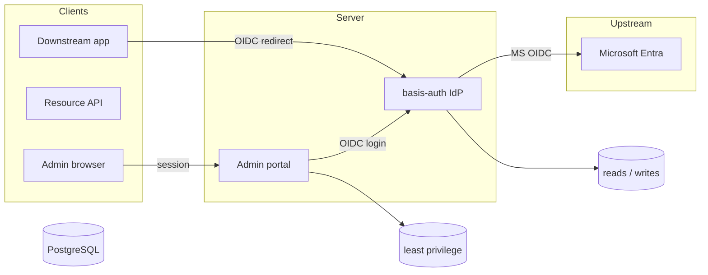
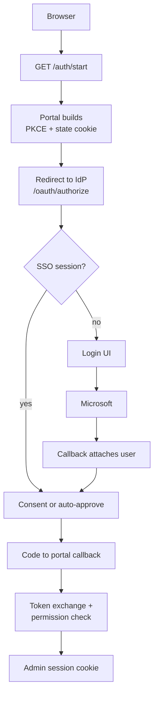
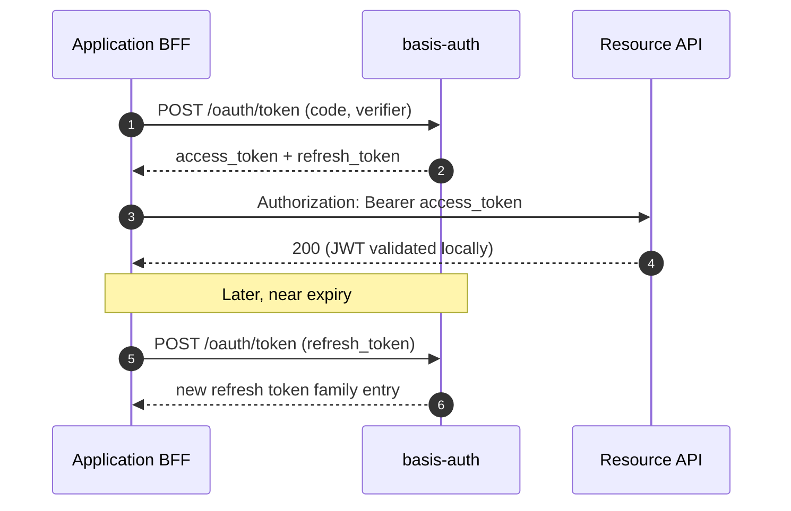

# Architecture

basis-auth is a compact OpenID Connect provider. One Hono process serves the
protocol and the login UI; an optional second process runs the management
portal. Both share one PostgreSQL database through separate roles.

## System components

The IdP is the only component that talks to Microsoft Entra. The portal never
sees upstream credentials: it authenticates its operators *through* the IdP
itself using authorization code flow with PKCE.

## Token model

Access tokens are ten-minute RS256 JWTs (`typ=at+jwt`) whose audience names a
resource API. Refresh tokens rotate on every use; reusing a rotated token
revokes the entire token family.

