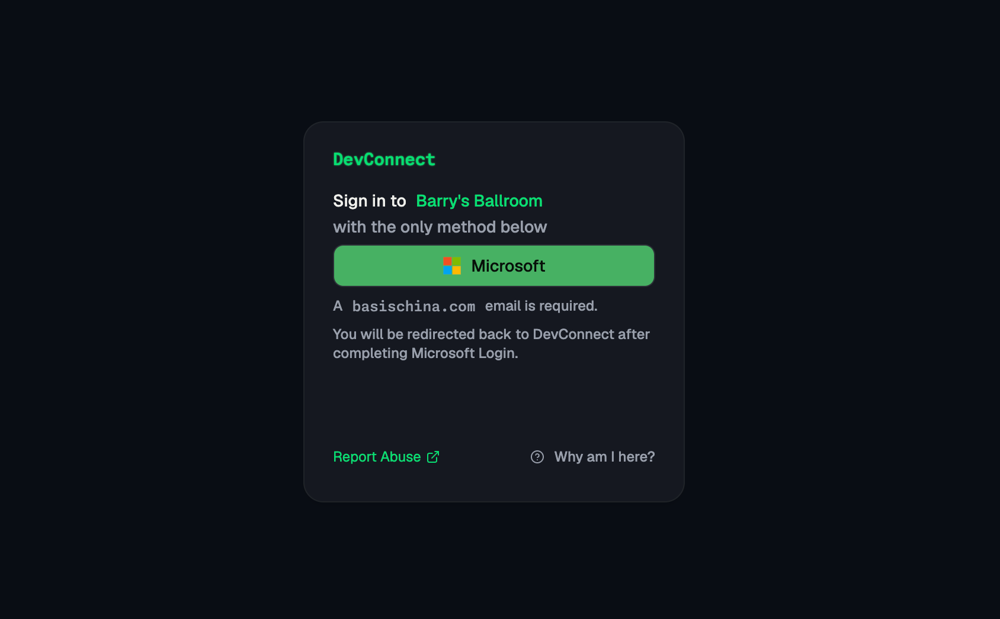
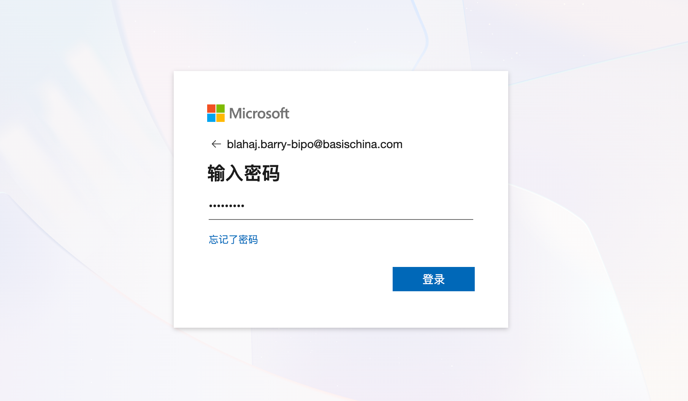
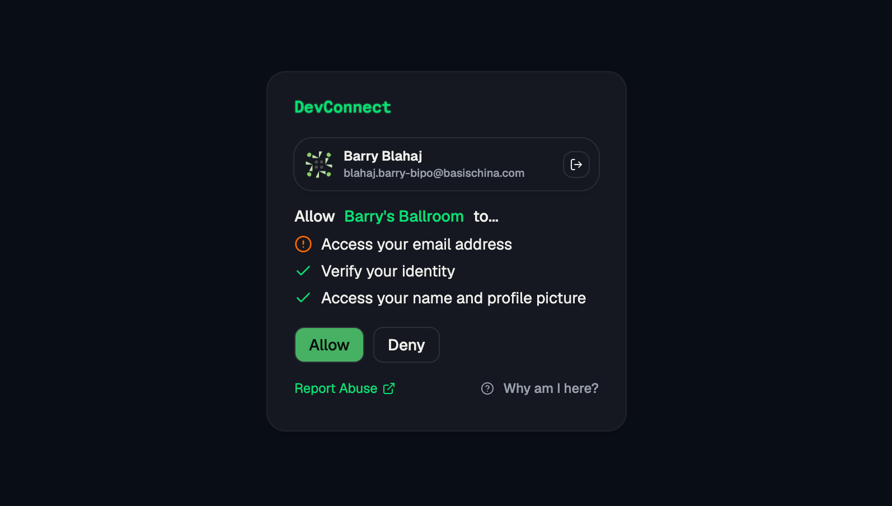

# DevConnect FAQ

## What is DevConnect?

DevConnect is a shared sign-in service for BASIS applications. It lets student projects use school Microsoft accounts without building their own password systems or requesting a separate Microsoft integration for every application.

## How does DevConnect work?

An application sends you to DevConnect, which redirects you to Microsoft to verify your school account.

Next, you complete your regular microsoft login:

When you return, review the requested access. Select `Allow` to continue to the application or `Deny` to cancel.

Afterwards, you will be redirected back to your application.

The core trick here is to authenticate every user to log into DevConnect first, as it is a certified BASIS application approved by the IT, with sensitive permissions (such as reading chat messages). 

This eliminates the need to create multiple applications, such as making two different sub-applications, one for Barry's Ballroom, and the other Barry's Honor Society, both requiring IT approval.

## It's not an official Microsoft Login, so it's not safe?

DevConnect DO have permission from the IT to read sensitive information, but it DOES NOT require them when unnecessary.

DevConnect first checks if a sub-app (e.g. Barry's Central Intelligence Agency) needs any sensitive permissions (such as reading chat messages). If it does, then DevConnect will request Microsoft to grant such permission to DevConnect first, then to the sub-app.

For apps that DO NOT require sensitive permission (e.g. Barry's Ballroom), DevConnect will NEVER request Microsoft for such permission, and DevConnect in turn will also not be able to use those sensitive permissions.

In other words, DevConnect does not request redundant or unnecessary permissions.

## Why is there no email and password field?

DevConnect does not create or manage passwords. Your account provider is responsible for checking your password, passkey, multifactor authentication, or other sign-in method.

## Does signing out of one application sign me out everywhere?

Each application keeps its own session. Signing out of an application ends that application's session, while signing out of Devconnect ends the shared Devconnect session. Your Microsoft session may remain active until you sign out of Microsoft separately.

~~To sign out of DevConnect, visit `auth.bisz.dev` and then...~~ (WIP)
To sign out of DevConnect, sign out of any sub-app first. Then, on the consent page, click the **Exit Icon** to log out of DevConnect.

To sign out of Microsoft, you have to... sign out from Microsoft. An easy way would be visiting [Your Microsoft Account](https://accounts.microsoft.com) and log out of there.

## I found an inappropriate application using DevConnect. What should I do?

~~Click the `Report Abuse` link on the bottom right.~~ (WIP)

Message `ChunPing.Wong12024-bisz@basischina.com` to destroy the app.

## What should I do if I cannot sign in?

Make sure you selected the correct Microsoft account and that the account is permitted to use the application. ONLY `@basischina.com` ACCOUNTS ARE ALLOWED

If the problem continues, **contact the sub-app owner first** (e.g. Contact the Student Council President if the Student Council portal is not working)

If you still have concerns, message `ChunPing.Wong12024-bisz@basischina.com` [OR CLICK ME](https://teams.microsoft.com/l/chat/0/0?users=chunping.wong12024-bisz@basischina.com) on Microsoft Teams. Yes he will respond ASAP.

## Who is Barry Blahaj
He is Barry

## Which district is BIPO???
Basis International Pacific Ocean

