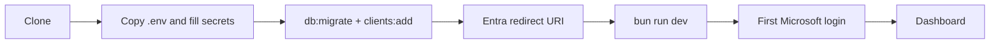

# Getting Started

## Requirements

- Node.js 24 or newer
- PostgreSQL 14 or newer (any local install or managed service; Docker is not required)
- A Microsoft Entra application for upstream sign-in

## Bootstrap

```bash
git clone https://github.com/basishacks/basis-auth.git
cd basis-auth
cp .env.example .env
bun install
```

Open `.env` and set the required values:

- `DATABASE_URL` — connection string for your PostgreSQL instance.
- `OIDC_COOKIE_KEYS` — at least one, comma-separated, ≥ 32 characters each.
  The placeholder values in `.env.example` are rejected at startup, so generate
  real random strings (e.g. `openssl rand -hex 32`). Production requires two.
- `INTERNAL_API_TOKEN` — ≥ 32 random characters used to authenticate the
  management portal's internal API calls.

For local development `OIDC_JWKS_JSON` may be left empty: a signing key pair is
generated automatically. In production you must supply `OIDC_JWKS_JSON` or
`OIDC_JWKS_FILE`.

Then create the schema and register the portal client:

```bash
bun run db:migrate
bun run clients:add
```

`bun run clients:add` opens an interactive walkthrough (name, type, redirect URIs,
resources, scopes, consent, filters). For a confidential client, leave the secret
blank to auto-generate a `sk-...` secret — it is printed once and only a scrypt
hash is stored, so copy it immediately. `bun run clients` opens the full menu
(list, add, remove, edit, register resource); TUI changes apply live with no restart.

## First administrator

Grant your Microsoft account portal access on first boot by listing it in
`BOOTSTRAP_PERMISSION_GRANTS_JSON` (see `.env.example`). Accounts named there
receive the listed permissions the first time the server starts and the grant
is absent from the database. You can also manage grants from the portal
afterwards.

## Configure Microsoft Entra

Register this redirect URI in your Entra application:

```text
http://localhost:3000/oauth/callback/microsoft
```

Then fill `MICROSOFT_ISSUER`, `MICROSOFT_CLIENT_ID`, and
`MICROSOFT_CLIENT_SECRET` in `.env`.

## Run

```bash
bun run dev
```

This single command starts three processes: the IdP on port 3000, a UI watcher,
and the management portal on port 3100. Open `http://localhost:3100`, sign in
with your Microsoft account, and you land on the dashboard (your bootstrapped
grant gives you access).


