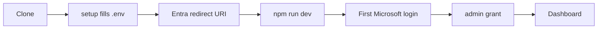

# Getting Started

## Requirements

- Node.js 24 or newer
- PostgreSQL (local Docker is the fastest path)
- A Microsoft Entra application for upstream sign-in

## Bootstrap

```bash
git clone --recurse-submodules https://github.com/basishacks/basis-auth.git
cd basis-auth
cp .env.example .env
npm install
npm run setup
```

`npm run setup` fills every generated secret directly into `.env`: the RS256
signing key, both cookie key pairs, the internal API token, and the management
portal's client registration. It never overwrites values you set by hand.

## Configure Microsoft Entra

Register this redirect URI in your Entra application:

```text
http://localhost:3000/oauth/callback/microsoft
```

Then fill `MICROSOFT_ISSUER`, `MICROSOFT_CLIENT_ID`, and
`MICROSOFT_CLIENT_SECRET` in `.env`.

## Run

```bash
npm run dev
```

This single command starts three processes: the IdP on port 3000, a UI watcher,
and the management portal on port 3100. Open `http://localhost:3100`, sign in
with your Microsoft account, then grant yourself portal access:

```bash
npm run admin:grant -- you@basischina.com portal.admins.manage
```

Refresh the browser to land on the dashboard.


