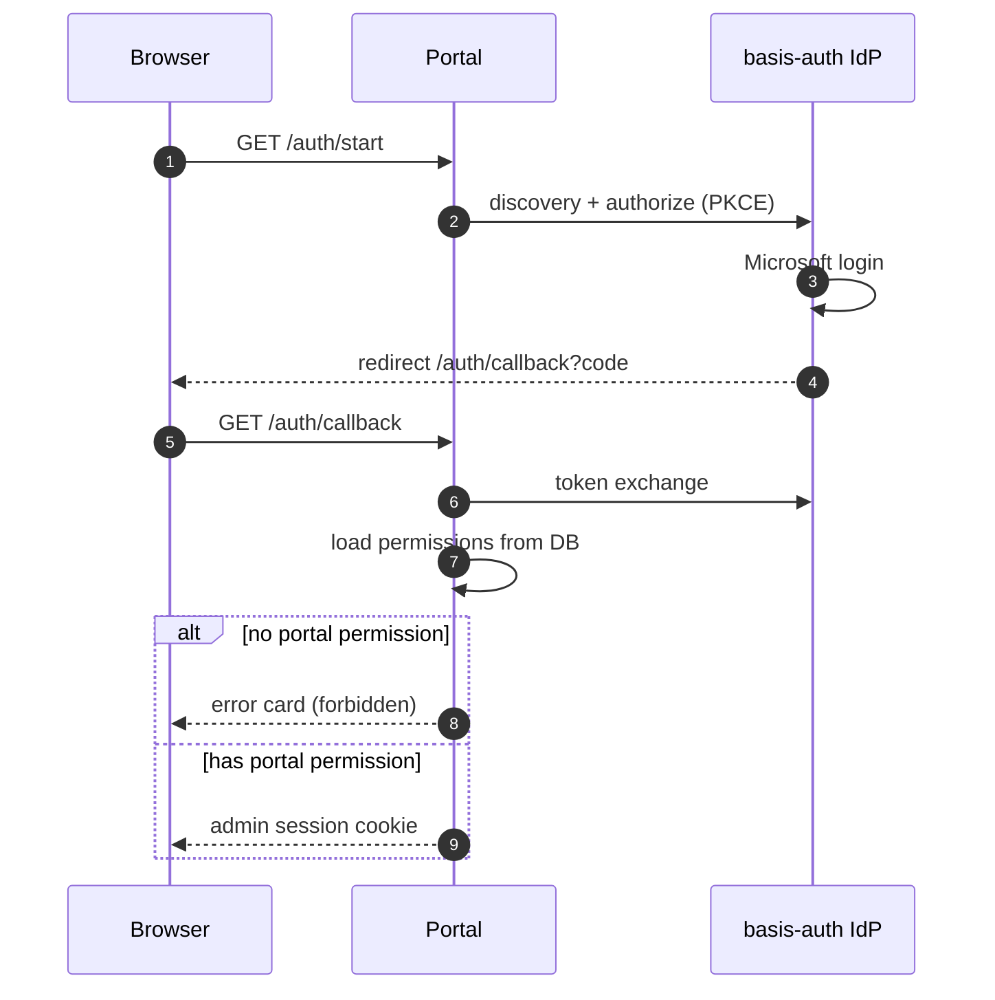
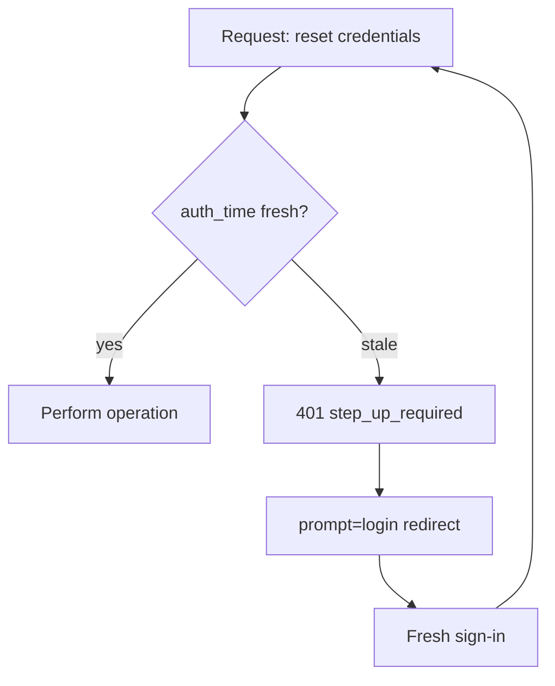

# Management Portal

The portal is an Entra-style administration surface for the directory. It runs
as its own process on port 3100 and every screen is permission-gated.

## Surfaces

| Section | What you can do |
| --- | --- |
| Overview | Live counters, recent sign-ins, recent admin actions, hygiene alerts |
| Users | Search, inspect, provision local accounts, disable, force sign-out, delete, bulk actions |
| Roles & admins | Every account holding a portal permission, grouped by role |
| App registrations | Register apps, rotate multi-secrets, edit properties, upload branding |
| Resource servers | Audiences and the scopes each accepts |
| Sessions & tokens | Revoke SSO sessions and refresh-token families |
| Consent grants | Review and revoke what users allowed apps to access |
| Sign-in logs | Every authentication attempt with filters |
| Audit logs | Append-only record of administrator actions |
| Settings | Emergency lockout switch |

## Portal authentication flow

Permissions are loaded fresh from the database on **every** request, so
revocations apply mid-session.

## Step-up re-authentication

Sensitive operations demand an authentication newer than five minutes. When it
is stale the API answers `401 step_up_required` and the UI round-trips through
`prompt=login`, then replays your request.

## Guardrails

- You cannot change your own permissions or disable yourself.
- The last holder of `portal.admins.manage` cannot be demoted from the UI.
- Accounts holding any portal permission are shielded: viewing or modifying
  them additionally requires `portal.privileged.read`.
- Destructive actions require typed confirmation.
- Granting or revoking roles fires an HMAC-signed webhook alert when
  `ALERT_WEBHOOK_URL` and `ALERT_WEBHOOK_SECRET` are configured.
