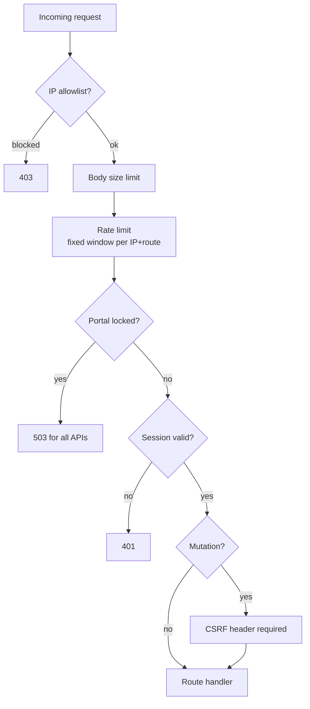
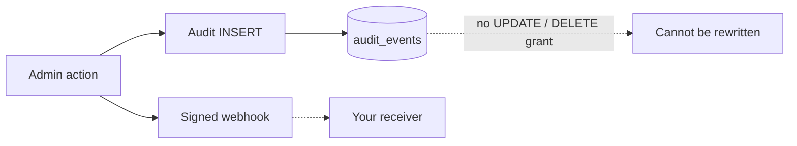

# Security Model

Defense in depth across four layers: perimeter, protocol, data, and operations.

## Perimeter controls



Rate limiting is a fixed-window, in-memory counter keyed by route and client
IP (see `src/middleware/rateLimit.ts`). One shared limiter applies 120 requests
per minute per IP+route to the token, revoke, authorize, consent, Microsoft
callback, and `/api/me` endpoints; exceeding it returns `429` with a
`Retry-After` header. The limiter is process-local, so horizontally scaled
deployments must share state (for example Redis) to stay effective.

## Content safety

User-controlled images (avatars, application logos, including SVG) are served
with a sandboxing policy so scripts can never execute on the IdP origin:

```text
Content-Security-Policy: sandbox; default-src 'none'; style-src 'unsafe-inline'
Content-Disposition: attachment
X-Content-Type-Options: nosniff
```

`` embedding keeps working; direct navigation downloads an inert file.

## Cryptography and secrets

- Client secrets, local passwords: scrypt with per-secret salt.
- Signing keys: RS256, published as JWKS; rotation documented in README.
- TOTP secrets encrypted at rest (AES-256-GCM); recovery codes stored hashed.
- All token comparisons are timing-safe; all SQL is parameterized.
- Plaintext secrets are shown exactly once and never logged.

## Audit immutability

The portal reaches the database only through the IdP's authenticated internal
API, which exposes no mutation path for sign-in or audit history. Those tables
are append-only by construction, making tampering impossible even with full
portal compromise.



## Emergency controls

| Control | Effect |
| --- | --- |
| Lockout switch | Rejects every portal API call until unlocked |
| IP allowlist | Only listed addresses reach the portal |
| Force sign-out | Destroys sessions and refresh-token families instantly |
| Disable account | Blocks sign-in everywhere and bumps the token barrier |

## Transport and logging

Production responses include HSTS (`max-age=63072000; includeSubDomains`).
Log lines flatten newlines so request-influenced strings cannot forge entries,
and local password failures count against both the account and the source IP.
